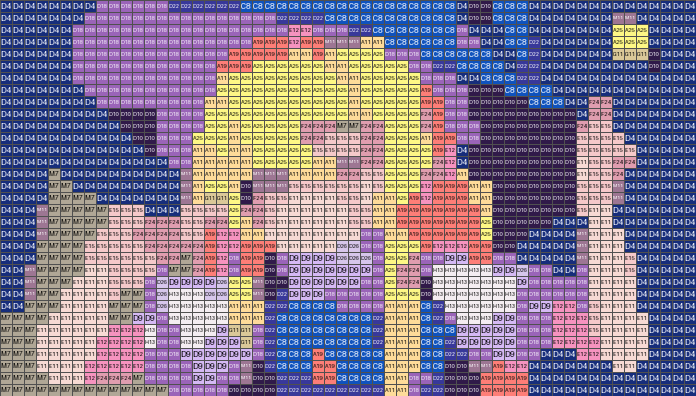

# pypindou

[](https://github.com/HansBug/pypindou/actions/workflows/test.yml)
[](https://pypindou.readthedocs.io/zh-cn/latest/)
[](https://codecov.io/gh/HansBug/pypindou)
[](https://gist.github.com/HansBug/ffa064987fd7d8f41e4e58d8aacc5c55)
[](https://gist.github.com/HansBug/ffa064987fd7d8f41e4e58d8aacc5c55)

`pypindou` 是一个纯 Python 拼豆图纸计算库，目标是把输入图像转换成真实拼豆色卡上的图纸、色号统计和可渲染预览。

项目优先支持国内拼豆语境，默认色卡是 `mard-221-alfonse-doudou`。国际色卡也会被统一转换成同一套
`Palette` / `BeadColor` dataclass 和同一份包内 `palettes.json` schema，供跨品牌或下游应用使用。

当前阶段重点放在可复用库能力，而不是 CLI 或 GUI：

- 图片缩放到指定拼豆格数。
- 支持亮度、对比度、饱和度、锐度、灰度和预滤波调节。
- 基于真实色卡做最近色匹配。
- 支持 RGB / Lab 距离空间。
- 支持可调强度 Floyd-Steinberg 抖动。
- 支持限制可用颜色列表、排除颜色、限制总颜色数。
- 支持邻域多数清理和小连通域合并，减少不利于手工操作的孤立色块。
- 默认过滤不可辨认色号，避免下游误用 `UNKNOWN-*`。
- 输出图纸网格、色号用量、预览图和符号图。
- 内置色卡资源由 submodule 生成并随 PyPI 包发布。
- 支持 Python 3.8 到 3.14，并在 Linux / Windows / macOS 上跑单元测试矩阵。

## 示例

下面示例使用像素风 Q 版图像生成，色卡为国内默认 MARD 221 核对版。示例参数偏向实际摆豆操作：低色数、大色块、无抖动、清理孤立色块。

| 输入图像 | 拼豆预览 | 符号图 |
| --- | --- | --- |
|  |  |  |
|  |  |  |

## 快速开始

```python
from pypindou import generate_pattern

pattern = generate_pattern(
    "input.png",
    palette="mard-221-alfonse-doudou",
    width=58,
    height=58,
    fit="cover",
    max_colors=32,
    prefilter="smooth",
    cleanup="majority",
    cleanup_passes=2,
    min_region_size=3,
)

print(pattern.color_counts())
pattern.to_image(scale=12).save("preview.png")
pattern.save_symbol_chart("symbols.png", cell_size=24)
pattern.save_symbol_chart("symbols.svg", cell_size=24)
```

`save_symbol_chart` 支持 PNG 和 SVG 输出；色号文字会自适应缩放并限制在各自 cell 内。

如果目标是更接近照片纹理，而不是减少操作复杂度，可以显式启用抖动：

```python
pattern = generate_pattern(
    "input.png",
    width=58,
    height=58,
    max_colors=48,
    quantize="floyd-steinberg",
    dither_strength=0.5,
)
```

照片输入通常建议先从 `max_colors=16..48`、`prefilter="smooth"`、`cleanup="majority"` 和 `min_region_size=2..4` 开始调。抖动会增加细碎色块，适合需要保留渐变和阴影纹理的图，不适合作为默认实操图纸。

## 色卡数据

包内静态色卡资源由以下 submodule 生成：

- `HansBug/pindou-color-data`：国内常用拼豆色卡数据，含 MARD、盼盼、COCO、漫漫、咪小窝、优肯等。
- `maxcleme/beadcolors`：Hama、Perler、Artkal、Nabbi 等国际色卡数据。

生成后的 `pypindou/resources/palettes.json` 使用统一格式：

- 顶层标记 `primary_standard: "domestic"` 和默认色卡 `mard-221-alfonse-doudou`。
- 每个 palette 都有相同字段：`id`、`title`、`description`、`standard`、`source`、`source_id`、`source_url`、`count`、`metadata`、`colors`。
- 每个 color 都有相同字段：`code`、`name`、`rgb`、`hex`、`group`、`source`、`unidentified`、`original_code`、`metadata`。
- 国内额外的市场/分组/证据数据和国外额外的 symbol/HSL/Lab 数据都进入 `metadata`，Python 侧共用同一套 dataclass。

更新 submodule 后重新生成包内资源：

```bash
git submodule update --init --recursive
make resource
```

列出可用色卡：

```python
from pypindou import list_palettes

for item in list_palettes():
    print(item["id"], item["standard"], item["title"], item["count"])
```

## 数据质量

国内色卡数据里可能存在上游无法确认真实色号的颜色。这类颜色会在源数据中标记为 `unidentified: true`。`pypindou` 默认过滤它们，只有显式设置 `allow_unidentified=True` 时才会参与图纸生成。

## 开发

```bash
git submodule update --init --recursive
python -m pip install -r requirements-test.txt -r requirements-build.txt -r requirements-doc.txt
make test
make docs
make package
```

README 示例图可重新生成：

```bash
python -m examples.build_readme_images
```

本仓库刻意不提供 CLI。面向用户的 CLI、Web UI、人工改色流程、PDF 导出、深度学习辅助抠图/分割等，都应该作为下游应用层基于这个库继续构建。
